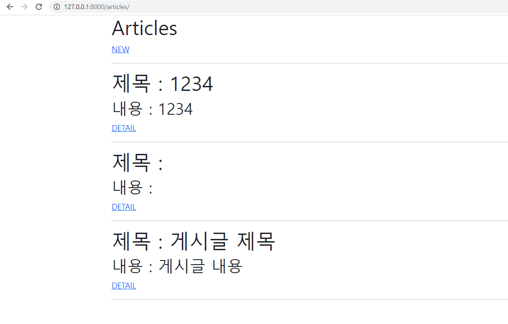
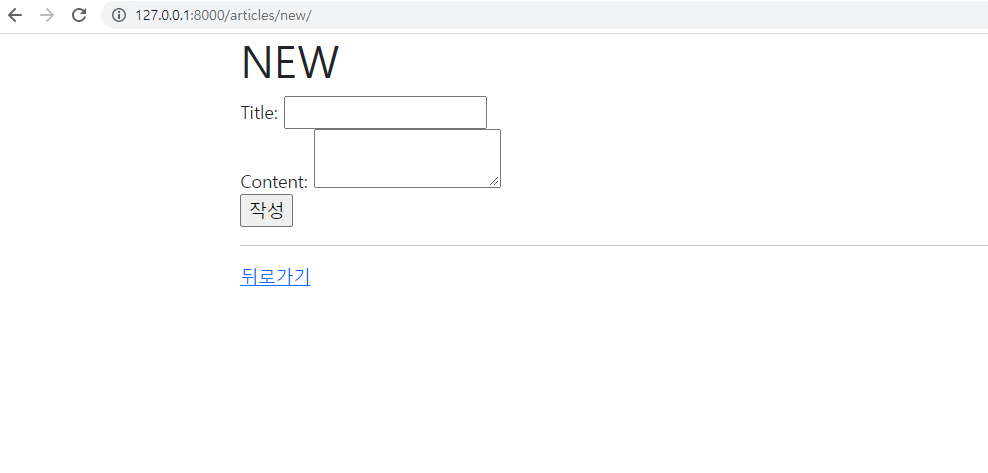

# ❖ Article CR (CREATE & READ) 

CR을 갖춘 장고 프로젝트를 제작하고, 결과 사진과 핵심 코드(url, view, template, model)를 별도의 마크다운 파일에 작성하여 제출하시오. 


## 1) url.py

```python
# crud/urls.py

from django.contrib import admin
from django.urls import path, include

urlpatterns = [
    path('admin/', admin.site.urls),
    path('articles/', include('articles.urls')),
]

# articles/urls.py

from django.urls import path
from . import views

app_name = 'articles'
urlpatterns = [
    path('', views.index, name="index"),
    path('new/', views.new, name='new'),
    path('create/', views.create, name='create'),
]
```


## 2) views.py

```python
# articles/views.py

from django.shortcuts import render, redirect
from .models import Article
# Create your views here.

def index(request):
    articles = Article.objects.all()
    context = {
        'articles': articles,
    }
    return render(request, 'articles/index.html', context)

def new(request):
    return render(request, 'articles/new.html')

def create(request):
    title = request.POST.get('title')
    content = request.POST.get('content')

    article = Article(title=title, content=content)
    article.save()

    return redirect('articles:index')
```


## 3) template

```html
# index.html




  <h1>Articles</h1>
  <a href="">NEW</a>
  <hr>
  
    <h1>제목 : {{ article.title }}</h1>
    <h2>내용 : {{ article.content }}</h2>
    <a href="">DETAIL</a>
    <hr>
  


```


```html
# new.html



  <h1>NEW</h1>
  <form action="" method="POST">
    
    <label for="title">Title: </label>
    <input type="text" name="title" id="title"><br>
    <label for="content">Content: </label>
    <textarea name="content" id="content"></textarea><br>
    <input type="submit" value="작성">
  </form>
  <hr>
  <a href="">뒤로가기</a>


```


## 4) model

```python
# articles/models.py

from django.db import models

# Create your models here.
class Article(models.Model):
    title = models.CharField(max_length=20)
    content = models.TextField()
    created_at = models.DateTimeField(auto_now_add=True)
    updated_at = models.DateTimeField(auto_now=True)
```


## 5) 결과화면

1) localhost/articles/




2) localhost/articles/new/



