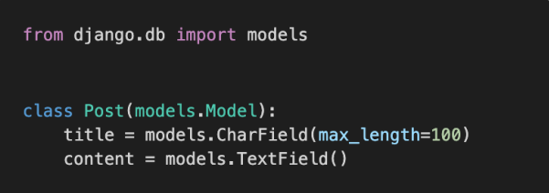
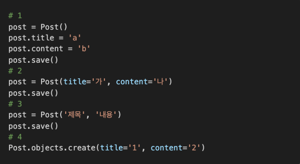
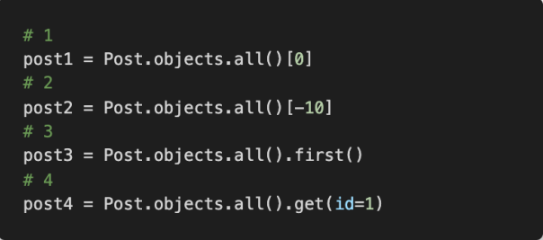

# Django Model

posts앱 안의 models.py 파일에 다음과 같은 코드를 작성하였다.

## 1. models.py를 작성한 후 마이그레이션 작업을 위해 터미널에 작성해야 하는 두 개의 핵심 명령어를 작성하시오.

`python manage.py makemigrations`

`python manage.py migrate`

## 2. 다음 중 새로운 Post를 저장하기 위하여 작성한 코드 중 옳지 않은 것을 고르시오

(a) : 3번

## 3. Post가 10개 저장되어 있고 id의 값이 1부터 10까지라고 가정할 때 가장 첫 번째 Post를 가져오려고 한다. 다음 중 옳지 않은 코드를 고르시오.

(a) : 3번

## 4. my_post 변수에 Post 객체 하나가 저장되어 있다. title을 “안녕하세요” content를 “반갑습니다” 로 수정하기 위한 코드를 작성하시오.

`my_post.title = '안녕하세요'`

`my_post.content = '반갑습니다'`

`my_post.save()`

## 5. 만들어진 모든 Post 데이터를 QuerySet형태로 반환 해주기 위해 빈칸에 들어갈 코드를 작성하시오.

(a) : objects

(b) : all