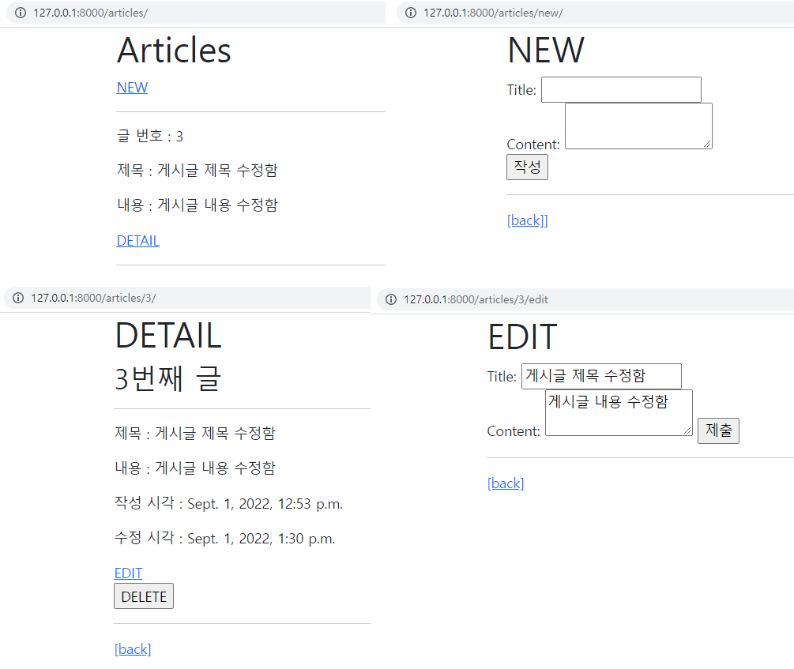

❖ Django Project 

CRUD를 모두 갖춘 장고 프로젝트를 제작하고 결과 사진과 코드(url, view, template, model) 를 별도의 마크다운 파일에 작성하여 제출하시오. 

 기본 설정 

1) 프로젝트 이름은 crud, 앱 이름은 articles로 설정한다. 
2) 모든 템플릿에서 상속받아 사용할 base.html을 작성한다. base.html이 위치한 templates 디렉토리는 프로젝트 및 앱 디렉토리와 동일한 위치에 생성한다. base.html은 Bootstrap CDN을 포함하고 있어야 한다. 
3) URLconf를 이용하여 articles의 url pattern은 따로 작성한다. 
4) Article 데이터는 제목, 내용, 작성시간, 수정시간을 저장하며 제목은 20자까지 DB에 저장할 수 있다. 
5) template 파일은 template namespace를 고려한 경로에 생성하고 아래 페이지를 참고 하여 작성한다. 


## 1) url.py

```python
# crud/urls.py

from django.contrib import admin
from django.urls import path, include

urlpatterns = [
    path('admin/', admin.site.urls),
    path('articles/', include('articles.urls')),
]

# articles/urls.py

from django.urls import path
from . import views

app_name = 'articles'
urlpatterns = [
    path('', views.index, name="index"),
    path('new/', views.new, name='new'),
    path('create/', views.create, name='create'),
]
```


## 2) views.py

#### crud/urls.py

```python
from django.contrib import admin
from django.urls import path, include

urlpatterns = [
    path('admin/', admin.site.urls),
    path('articles/', include('articles.urls')),
]

```

#### articles/urls.py

```python
from django.urls import path
from . import views

app_name = 'articles'
urlpatterns = [
    path('', views.index, name="index"),
    path('new/', views.new, name='new'),
    path('create/', views.create, name='create'),
    path('<int:pk>/', views.detail, name='detail'),
    path('<int:pk>/delete/', views.delete, name='delete'),
    path('<int:pk>/edit', views.edit, name='edit'),
    path('<int:pk>/update/', views.update, name='update'),
]
```


## 3) template

```html
# index.html




  <h1>Articles</h1>
  <a href="">NEW</a>
  <hr>
  
    <p>글 번호 : {{ article.pk }}</p>
    <p>제목 : {{ article.title }}</p>
    <p>내용 : {{ article.content }}</p>
    <a href="">DETAIL</a>
    <hr>
  

```


```html
# new.html



  <h1>NEW</h1>
  <form action="" method="POST">
    
    <label for="title">Title: </label>
    <input type="text" name="title" id="title"><br>
    <label for="content">Content: </label>
    <textarea name="content" id="content"></textarea><br>
    <input type="submit" value="작성">
  </form>
  <hr>
  <a href="">[back]]</a>


```


```html
# detail.html



  <h1>DETAIL</h1>
  <h2>{{ article.pk }}번째 글</h2>
  <hr>
  <p>제목 : {{ article.title }}</p>
  <p>내용 : {{ article.content }}</p>
  <p>작성 시각 : {{ article.created_at }}</p>
  <p>수정 시각 : {{ article.updated_at }}</p>
  <a href="">EDIT</a>
  <form action="" method="POST">
    
    <input type="submit" value="DELETE">
  </form>
  <hr>
  <a href="">[back]</a>

```


```html
# edit.html



  <h1>EDIT</h1>
  <form action="" method="POST">
    
    <label for="title">Title: </label>
    <input type="text" name="title" id="title" value="{{ article.title }}"><br>
    <label for="content">Content: </label>
    <textarea name="content" id="content">{{ article.content }}</textarea>
    <input type="submit">
  </form>
  <hr>
  <a href="">[back]</a>

```


## 4) model

```python
# articles/models.py

from django.db import models

# Create your models here.
class Article(models.Model):
    title = models.CharField(max_length=20)
    content = models.TextField()
    created_at = models.DateTimeField(auto_now_add=True)
    updated_at = models.DateTimeField(auto_now=True)
```


## 5) 결과화면

